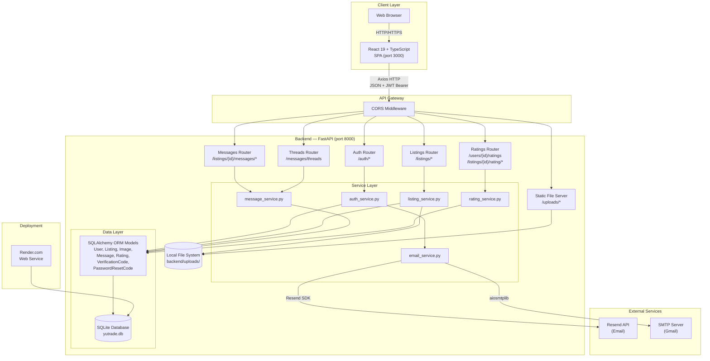
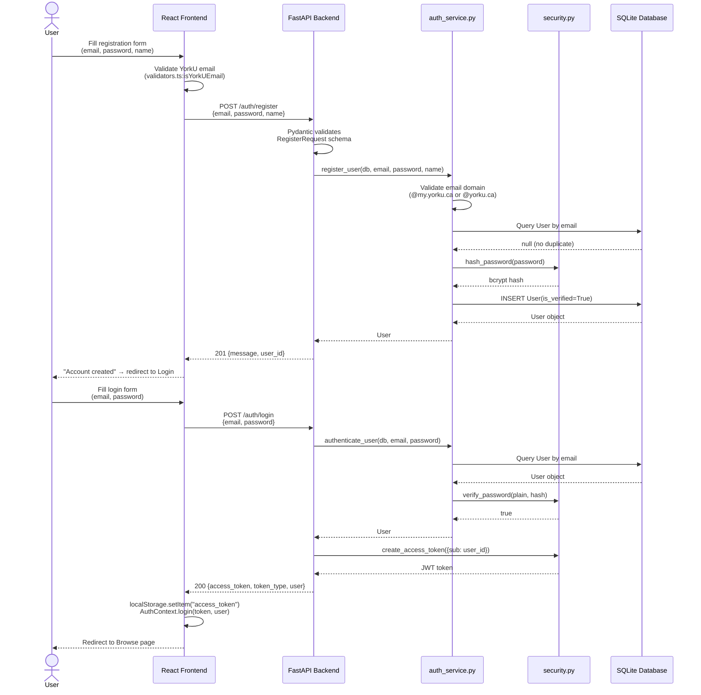
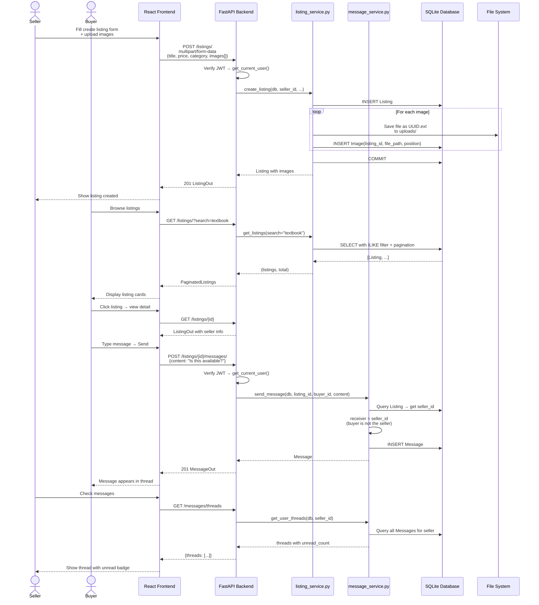
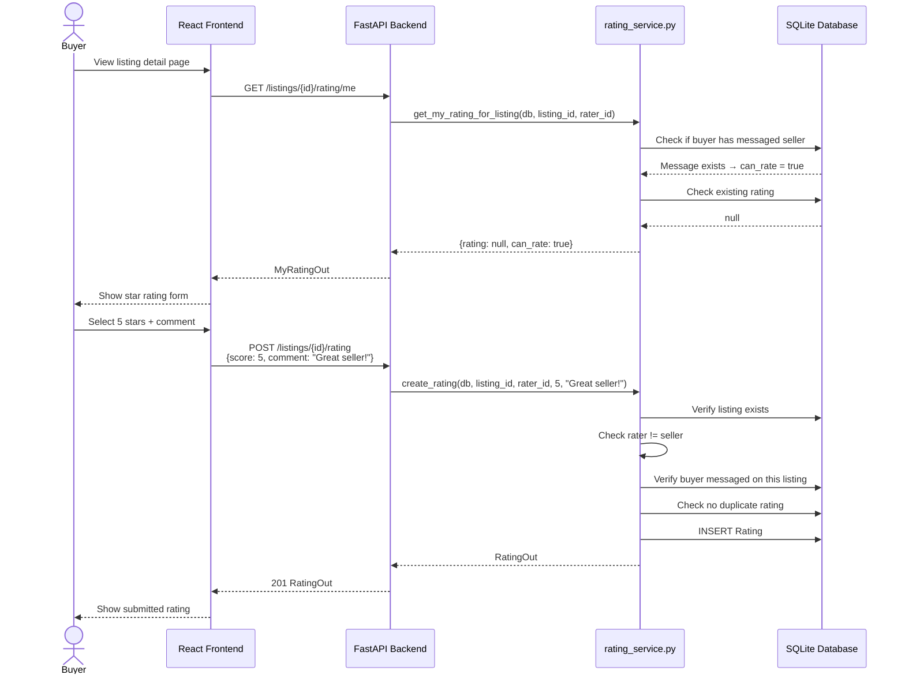
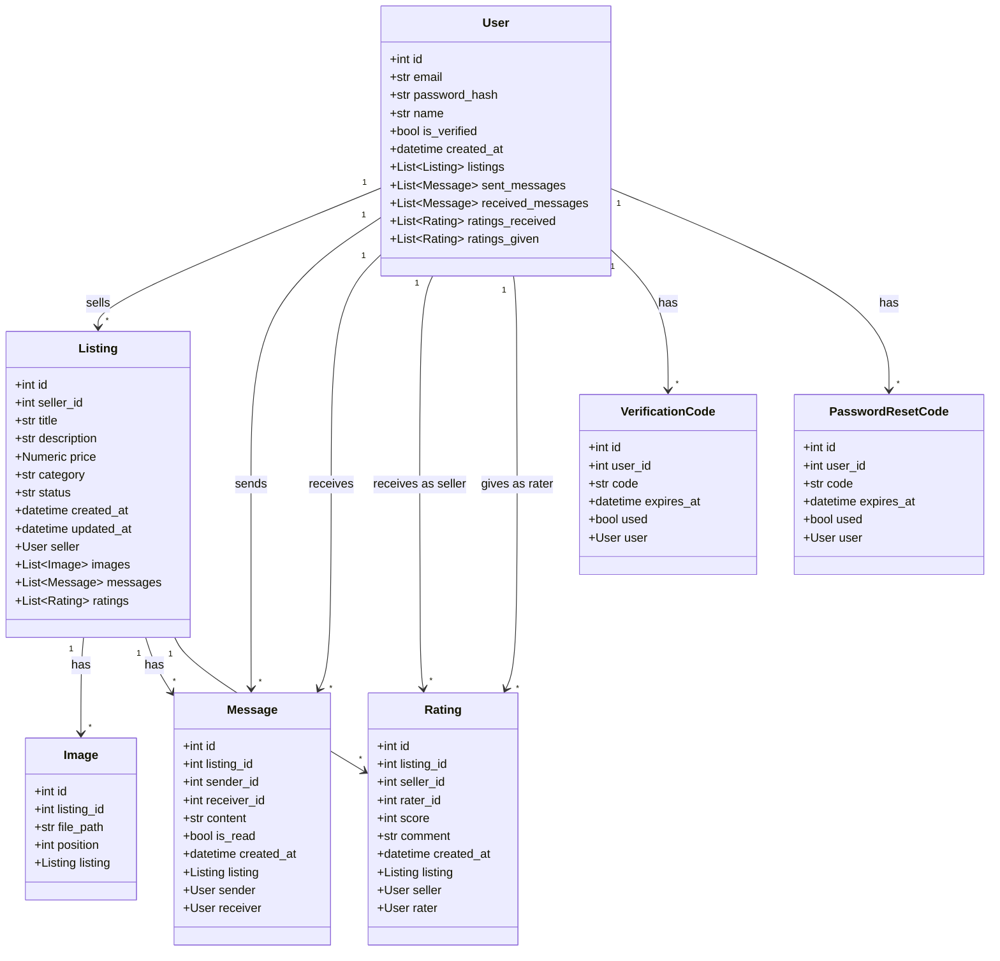

# YUTrade — Final Project Report

**Project Name:** YUTrade — York University Campus Marketplace  
**Course:** EECS 4314 — Advanced Software Engineering, Winter 2026  
**Date:** April 5, 2026  
**GitHub Repository:** https://github.com/mai2161/YUTrade  
**Deployed URL:** Render (yutrade-api on render.com) — backend API with React frontend  

**Team Members:**

| Name | Role |
|------|------|
| Daniel Chahine | Authentication, Security, JWT, Password Flows |
| Michael Byalsky (Mickey) | Database Layer, ORM Models, Test Fixtures |
| Lakshan Kandeepan | Listings CRUD, Image Upload, Search/Filter |
| Rajendra Brahmbhatt (Raj) | Messaging, Threads, CI/CD |
| Mai Komar | Frontend Pages, API Layer, Router Setup |
| Harnaindeep Kaur | Frontend Components, Styling, Auth Context |

---

## 2. Requirements Traceability Matrix — Functional Requirements (/6)

| Req ID | Requirement Description | Status | Evidence (File / Function) | Test Case ID |
|--------|------------------------|--------|---------------------------|-------------|
| FR-01 | User registration with YorkU email validation (`@my.yorku.ca`, `@yorku.ca`) | Met | `backend/app/services/auth_service.py:register_user()`, `backend/app/schemas/auth.py:RegisterRequest.validate_york_email()` | TC-01 to TC-16 |
| FR-02 | User login with JWT token issuance | Met | `backend/app/routers/auth.py:login()`, `backend/app/utils/security.py:create_access_token()` | TC-17 to TC-24 |
| FR-03 | Password hashing with bcrypt | Met | `backend/app/utils/security.py:hash_password()`, `verify_password()` | TC-17, TC-19 |
| FR-04 | Forgot password / reset password flow with 6-digit code | Met | `backend/app/services/auth_service.py:request_password_reset()`, `reset_password()` | TC-25 to TC-31 |
| FR-05 | Get current user profile (`GET /auth/me`) | Met | `backend/app/routers/auth.py:get_me()` | TC-32 to TC-34 |
| FR-06 | Update user profile name (`PATCH /auth/me`) | Met | `backend/app/routers/auth.py:update_me()`, `backend/app/services/auth_service.py:update_profile()` | TC-35 to TC-37 |
| FR-07 | Change password (authenticated) | Met | `backend/app/routers/auth.py:change_password_endpoint()` | TC-38 to TC-41 |
| FR-08 | Delete account with cascade cleanup | Met | `backend/app/services/auth_service.py:delete_account()` | TC-42 to TC-44 |
| FR-09 | Create listing with multipart image upload | Met | `backend/app/routers/listings.py:create_listing()`, `backend/app/services/listing_service.py:create_listing()` | TC-45 to TC-54 |
| FR-10 | Browse listings with pagination | Met | `backend/app/routers/listings.py:get_listings()`, `backend/app/services/listing_service.py:get_listings()` | TC-55 to TC-68 |
| FR-11 | Search listings by keyword (title and description) | Met | `backend/app/services/listing_service.py:get_listings()` — `Listing.title.ilike()` / `Listing.description.ilike()` | TC-56 to TC-58 |
| FR-12 | Filter listings by category, price range, date listed | Met | `backend/app/services/listing_service.py:get_listings()` lines 124–159 | TC-59 to TC-68 |
| FR-13 | Sort listings (newest, price low-to-high, price high-to-low) | Met | `backend/app/services/listing_service.py:get_listings()` lines 154–159 | TC-63 to TC-65 |
| FR-14 | Get single listing by ID | Met | `backend/app/routers/listings.py:get_listing_by_id()` | TC-69, TC-70 |
| FR-15 | Update listing (owner only) with image add/delete | Met | `backend/app/routers/listings.py:update_listing()`, `backend/app/services/listing_service.py:update_listing()` | TC-71 to TC-79 |
| FR-16 | Delete listing with cascade (images on disk + DB rows) | Met | `backend/app/services/listing_service.py:delete_listing()` | TC-80 to TC-83 |
| FR-17 | Send message on a listing (buyer → seller) | Met | `backend/app/routers/messages.py:create_message()`, `backend/app/services/message_service.py:send_message()` | TC-84 to TC-91 |
| FR-18 | Seller reply to buyer messages | Met | `backend/app/services/message_service.py:send_message()` — detects existing conversation | TC-85 |
| FR-19 | Self-messaging prevention | Met | `backend/app/services/message_service.py:send_message()` — checks `sender_id == receiver_id` | TC-88 |
| FR-20 | Get messages for a listing thread (auto-marks as read) | Met | `backend/app/services/message_service.py:get_messages()` | TC-92 to TC-95 |
| FR-21 | Mark messages as read endpoint | Met | `backend/app/routers/messages.py:read_messages()` | TC-98 |
| FR-22 | List all message threads for current user | Met | `backend/app/routers/threads.py:list_threads()`, `backend/app/services/message_service.py:get_user_threads()` | TC-99 to TC-105 |
| FR-23 | Rate a seller (1–5 stars + optional comment, requires prior messaging) | Met | `backend/app/routers/ratings.py:create_rating()`, `backend/app/services/rating_service.py:create_rating()` | TC-106 to TC-118 |
| FR-24 | Update / delete own rating | Met | `backend/app/routers/ratings.py:update_rating()`, `delete_rating()` | TC-119 to TC-124 |
| FR-25 | Get seller ratings with average score | Met | `backend/app/services/rating_service.py:get_seller_ratings()` | TC-125 to TC-130 |
| FR-26 | Check rating eligibility (`GET /listings/{id}/rating/me`) | Met | `backend/app/services/rating_service.py:get_my_rating_for_listing()` | TC-113 to TC-115 |
| FR-27 | Frontend: Registration page with YorkU email validation | Met | `frontend/src/pages/RegisterPage.tsx`, `frontend/src/utils/validators.ts:isYorkUEmail()` | — |
| FR-28 | Frontend: Login page with JWT storage | Met | `frontend/src/pages/LoginPage.tsx`, `frontend/src/context/AuthContext.tsx:login()` | — |
| FR-29 | Frontend: Browse page with search, filters, pagination | Met | `frontend/src/pages/BrowsePage.tsx`, `frontend/src/components/SearchBar.tsx` | — |
| FR-30 | Frontend: Create listing page with image upload | Met | `frontend/src/pages/CreateListingPage.tsx`, `frontend/src/components/ImageUpload.tsx` | — |
| FR-31 | Frontend: Listing detail page with messaging | Met | `frontend/src/pages/ListingDetailPage.tsx`, `frontend/src/components/MessageThread.tsx` | — |
| FR-32 | Frontend: My Listings page (manage own listings) | Met | `frontend/src/pages/MyListingsPage.tsx` | — |
| FR-33 | Frontend: Messages page (all threads) | Met | `frontend/src/pages/MessagesPage.tsx` | — |
| FR-34 | Frontend: Protected routes for authenticated pages | Met | `frontend/src/components/ProtectedRoute.tsx` | — |
| FR-35 | Frontend: Forgot/Reset password pages | Met | `frontend/src/pages/ForgotPasswordPage.tsx`, `frontend/src/pages/ResetPasswordPage.tsx` | — |
| FR-36 | Frontend: Seller profile page with ratings display | Met | `frontend/src/pages/SellerProfilePage.tsx` | — |
| FR-37 | Frontend: Account management (change name, password, delete) | Met | `frontend/src/pages/AccountPage.tsx` | — |
| FR-38 | Frontend: Edit listing page with image management | Met | `frontend/src/pages/EditListingPage.tsx` | — |
| FR-39 | Frontend: Campus meetup maps page | Met | `frontend/src/pages/MapsPage.tsx` | — |
| FR-40 | Frontend: Star rating component | Met | `frontend/src/components/StarRating.tsx` | — |

---

## 3. Requirements Traceability Matrix — Non-Functional Requirements (/4)

| Req ID | Requirement Category | Description | Status | Evidence |
|--------|---------------------|-------------|--------|----------|
| NFR-01 | **Security — Authentication** | JWT-based auth with bcrypt password hashing; tokens expire after configurable time | Met | `backend/app/utils/security.py` — HS256 JWT with expiration, bcrypt via passlib CryptContext |
| NFR-02 | **Security — Authorization** | Owner-only enforcement on listing updates/deletes; protected routes require valid JWT | Met | `backend/app/dependencies.py:get_current_user()`, ownership checks in `listing_service.py:update_listing()`, `delete_listing()` |
| NFR-03 | **Security — Input Validation** | Pydantic schemas validate all inputs; email domain restriction; password length limits (8–72 bytes); price > 0 | Met | `backend/app/schemas/auth.py` (field validators), `backend/app/schemas/listing.py` (Field constraints), `backend/app/schemas/rating.py` (score ge=1 le=5) |
| NFR-04 | **Security — Data Protection** | Password hash never exposed in API responses; `.env` for secrets; `.gitignore` excludes `.env` files | Met | `backend/app/schemas/user.py:UserOut` — no `password_hash` field; `.gitignore` lines 55–59 |
| NFR-05 | **Security — CORS** | CORS middleware configured with allowed origins via environment variable | Met | `backend/app/main.py` lines 47–53; `backend/app/config.py:ALLOWED_ORIGINS` |
| NFR-06 | **Performance — Pagination** | All listing queries paginated with configurable page/limit (max 100) | Met | `backend/app/routers/listings.py:get_listings()` — `limit: int = Query(20, ge=1, le=100)` |
| NFR-07 | **Performance — Eager Loading** | SQLAlchemy `joinedload` used for related objects to avoid N+1 queries | Met | `backend/app/services/listing_service.py:get_listings()` — `joinedload(Listing.images)`, `joinedload(Listing.seller)` |
| NFR-08 | **Scalability — Layered Architecture** | Router → Service → DB separation; services contain business logic, routers handle HTTP | Met | `backend/app/routers/`, `backend/app/services/`, `backend/app/models/` — strict layer separation |
| NFR-09 | **Responsiveness** | Mobile-responsive CSS with media queries, hamburger menu, clamp-based padding | Met | `frontend/src/styles/global.css` — `@media` queries, `.navbar-hamburger`, `clamp()` usage; `frontend/src/components/Navbar.tsx` — mobile menu state |
| NFR-10 | **Error Handling** | Consistent HTTP error codes (400/401/403/404/409/422) with `{"detail": "..."}` JSON bodies | Met | All routers use `HTTPException` with specific status codes and descriptive messages |
| NFR-11 | **Code Quality — Type Safety** | TypeScript interfaces for all API types; Pydantic schemas for all backend I/O | Met | `frontend/src/types/index.ts` (22 interfaces), `backend/app/schemas/` (5 schema modules) |
| NFR-12 | **Accessibility** | Focus-visible outlines; `aria-label` on hamburger menu; semantic HTML structure | Partially Met | `frontend/src/styles/global.css` — `:focus-visible` styling; `Navbar.tsx` — `aria-label="Toggle menu"`; but limited ARIA roles elsewhere |
| NFR-13 | **Maintainability — Environment Config** | All secrets/config via environment variables with sensible defaults | Met | `backend/app/config.py:Settings` class, `backend/.env.example`, `frontend/.env.example` |
| NFR-14 | **Data Integrity — Cascade Deletes** | Foreign key enforcement with `PRAGMA foreign_keys=ON`; cascade deletes for listings → images, messages, ratings | Met | `backend/app/database.py` lines 24–29; `backend/app/models/listing.py` — `cascade="all, delete-orphan"` on images/ratings |
| NFR-15 | **UI Consistency** | Design system with CSS custom properties (colors, typography, spacing, shadows) | Met | `frontend/src/styles/variables.css` — 87 CSS custom properties; YU branding colors; consistent design tokens |

---

## 4. Architecture Diagram (/5)



### Architecture Explanation

YUTrade follows a **three-tier client-server architecture**:

1. **Presentation Layer (Frontend):** A React 19 single-page application written in TypeScript. It communicates with the backend via an Axios HTTP client (`frontend/src/api/client.ts`) that auto-injects JWT tokens from `localStorage` into every request. The frontend uses React Router v6 for client-side routing and React Context for global auth state.

2. **Application Layer (Backend):** A FastAPI (Python) application following the **Router → Service → Database** pattern. Routers (`backend/app/routers/`) handle HTTP concerns (status codes, query params, dependency injection). Services (`backend/app/services/`) contain business logic. Dependencies (`backend/app/dependencies.py`) provide the database session and authenticated user via FastAPI's dependency injection.

3. **Data Layer:** SQLite database accessed via SQLAlchemy ORM. Seven models define the schema: `User`, `Listing`, `Image`, `Message`, `Rating`, `VerificationCode`, and `PasswordResetCode`. Foreign key enforcement is enabled at the SQLite level via `PRAGMA foreign_keys=ON`. Images are stored on the local filesystem with UUID filenames and served via FastAPI's `StaticFiles` mount.

**Cross-cutting concerns:** CORS middleware controls allowed origins. JWT (HS256 via python-jose) handles authentication. Bcrypt (via passlib) handles password hashing. Email delivery supports three backends: console (dev), Resend API, and SMTP.

---

## 5. Sequence Diagrams (/3)

### 5.1 User Registration and Login Flow



### 5.2 Listing Creation and Buyer Messaging Flow



### 5.3 Seller Rating Flow



---

## 6. Class Diagram / OOP Justification (/2)

The backend uses **SQLAlchemy ORM models** (Python classes inheriting from `declarative_base()`), which are classic OOP with attributes and relationships. The frontend uses **React functional components with TypeScript interfaces**, which is a component-based architecture.

### Backend ORM Class Diagram



### Frontend Component Architecture

The frontend uses a **component-based architecture** with React functional components and hooks — not classical OOP, but organized via:

- **Context Pattern**: `AuthContext.tsx` provides global auth state via React Context API
- **Custom Hooks**: `useAuth.ts` encapsulates auth state consumption
- **TypeScript Interfaces**: `types/index.ts` defines 22 strongly-typed interfaces for all data models
- **API Module Pattern**: `api/client.ts`, `api/auth.ts`, `api/listings.ts`, `api/messages.ts`, `api/ratings.ts` encapsulate all HTTP calls

This is the idiomatic approach for modern React — class components and traditional OOP have been superseded by functional composition with hooks.

---

## 7. Design Patterns & Course Concepts (/5)

### Design Patterns

| Pattern | Where Used | Why Chosen | How It Works |
|---------|-----------|------------|--------------|
| **Repository Pattern** | `backend/app/services/*.py` | Separates data access logic from business logic | Service functions (e.g., `listing_service.get_listings()`) encapsulate all SQLAlchemy queries, keeping routers free of DB logic |
| **Dependency Injection** | `backend/app/dependencies.py` | Decouples components, enables testing | FastAPI's `Depends()` injects `get_db()` sessions and `get_current_user()` into route handlers; tests override `get_db` with in-memory DB |
| **Middleware Pattern** | `backend/app/main.py:CORSMiddleware` | Cross-cutting concern (CORS) applied globally | FastAPI middleware intercepts all requests/responses to add CORS headers |
| **Interceptor Pattern** | `frontend/src/api/client.ts` | Centralizes auth token injection and error handling | Axios request interceptor adds JWT from localStorage; response interceptor catches 401s and redirects to login |
| **Provider Pattern** | `frontend/src/context/AuthContext.tsx` | Global state without prop drilling | `AuthProvider` wraps the app and provides user/token state to all components via React Context |
| **Guard Pattern** | `frontend/src/components/ProtectedRoute.tsx` | Prevents unauthorized access to routes | Checks `isAuthenticated` before rendering children; redirects to `/login` if not authenticated |
| **Strategy Pattern** | `backend/app/services/email_service.py` | Multiple email delivery backends | `EMAIL_BACKEND` config selects between console, Resend API, or SMTP — same interface, different implementations |
| **Facade Pattern** | `frontend/src/api/auth.ts`, `listings.ts`, `messages.ts`, `ratings.ts` | Simplifies API consumption | Each module exposes clean async functions that hide Axios configuration, URL construction, and response extraction |
| **Observer Pattern** | `frontend/src/context/AuthContext.tsx` + `useAuth.ts` | Reactive state updates across components | Components subscribe to auth state changes via `useAuth()` hook; `login()`/`logout()` trigger re-renders across all subscribers |
| **Builder Pattern** | `frontend/src/api/listings.ts:updateListing()` | Constructs complex multipart requests | Conditionally appends form fields, new images, and delete IDs to `FormData` before sending |
| **Cascade Pattern** | `backend/app/models/listing.py` | Ensures referential integrity on delete | `cascade="all, delete-orphan"` on images/ratings; explicit message cleanup in `delete_listing()` |

### Course Concepts Demonstrated

| Concept | Evidence |
|---------|----------|
| **REST API Design** | All endpoints follow REST conventions: resource-based URLs, proper HTTP verbs (GET/POST/PATCH/DELETE), standard status codes (201 Created, 204 No Content, etc.), JSON responses |
| **Separation of Concerns** | Three-layer backend (Router/Service/DB); frontend separates API, state, components, pages, types, and styles into distinct directories |
| **DRY (Don't Repeat Yourself)** | Shared test helpers (`_create_listing`, `_get_user_id`, `_register_and_login`); reusable `get_current_user` dependency; CSS custom properties for consistent theming |
| **SOLID — Single Responsibility** | Each service handles one domain (auth, listings, messages, ratings); each router handles one resource's HTTP endpoints |
| **SOLID — Open/Closed** | Email service is open for extension (new backends like Resend added) without modifying existing console/SMTP code |
| **SOLID — Dependency Inversion** | Route handlers depend on abstract `Depends(get_db)` and `Depends(get_current_user)` — not concrete implementations; tests swap in in-memory DB |
| **Input Validation** | Both client-side (`validators.ts`) and server-side (Pydantic schemas with `field_validator`) validation — defense in depth |
| **Stateless Authentication** | JWT tokens — server stores no session state; tokens are self-contained with expiration claims |

---

## 8. Functional Requirements Demonstration (/5)

| Req ID | Requirement | Expected Behavior | Actual Outcome |
|--------|------------|-------------------|----------------|
| FR-01 | User registration | User submits valid `@my.yorku.ca` email, gets 201 response | Account created, user_id returned. Non-YorkU emails rejected with 422. |
| FR-02 | User login | Valid credentials return JWT + user info | 200 response with `access_token`, `token_type: "bearer"`, and `user` object. Wrong password → 401. |
| FR-04 | Password reset | Request code → code emailed → use code to set new password | 6-digit code generated, stored in DB with 15-min expiry. Code can be used once. New password works for login. |
| FR-06 | Profile update | Authenticated user updates display name | PATCH /auth/me with `{"name": "New Name"}` returns updated user. Change persists on subsequent GET /auth/me. |
| FR-08 | Delete account | Password confirmation required; cascades all data | Listings, messages, ratings, images (disk), and reset codes all deleted. User can no longer log in. |
| FR-09 | Create listing | Title, price, category, images uploaded via multipart form | Listing created with auto-increment ID, status "active", UUID-named images stored on disk. 201 returned with full listing data. |
| FR-10 | Browse listings | Paginated listing browse with defaults: active, page 1, limit 20 | Returns `{listings: [...], total, page, limit}`. Only active listings by default. |
| FR-11 | Search | Keyword matches title or description (case-insensitive) | `?search=calculus` returns listings with "calculus" in title or description via SQL ILIKE. |
| FR-12 | Filters | Category, price range, date listed filters | All filters composable. `?category=Textbooks&min_price=10&max_price=50` works correctly. Invalid `min_price > max_price` → 400. |
| FR-15 | Update listing | Owner can modify title, price, description, status, images | PATCH returns updated listing. Non-owner → 403. Can add new images and delete existing ones by ID. |
| FR-17 | Send message | Buyer messages seller on a listing | Message created with correct sender/receiver. Seller cannot initiate first message. Self-messaging prevented. |
| FR-22 | Thread listing | All conversations grouped by listing + other user | `GET /messages/threads` returns threads with `listing_title`, `other_user_id`, `last_message`, `unread_count`, sorted by most recent. |
| FR-23 | Rate seller | Buyer who has messaged can rate 1–5 stars | Rating created with score, optional comment. Cannot rate own listing. Cannot rate without prior messaging. Duplicate → 409. |
| FR-34 | Protected routes | Unauthenticated users redirected to login | `ProtectedRoute` component checks `isAuthenticated` from AuthContext. Returns `<Navigate to="/login">` if false. |

---

## 9. Usability & UI Consistency (/5)

### Design System

The project implements a comprehensive design system in `frontend/src/styles/variables.css` with **87 CSS custom properties** covering:

- **Typography:** Two font families (`--font-display: 'Sora'`, `--font-body: 'DM Sans'`)
- **York University Branding:** `--yu-red: #E31837`, `--yu-red-dark: #C41230`, plus light variants
- **Neutrals:** 10-step warm-tinted gray scale (`--gray-25` through `--gray-900`)
- **Semantic Colors:** `--text-primary`, `--text-secondary`, `--error-red`, `--success-green`, `--warning-amber`
- **Spacing & Radii:** 8 radius tokens from `--radius-xs: 4px` to `--radius-pill: 9999px`
- **Shadows:** 7 elevation levels (`--shadow-xs` to `--shadow-xl`) plus brand-colored shadows
- **Transitions:** Named easing functions (`--ease-out`, `--ease-spring`) with duration tokens

### Responsive Design

- **Navbar:** Hamburger menu for mobile (`Navbar.tsx` line 76: `aria-label="Toggle menu"`); desktop shows full nav links; clamp-based padding (`clamp(16px, 4vw, 40px)`)
- **Layout:** `max-width: var(--container-width, 1280px)` with auto margins for centered content
- **CSS Media Queries:** `global.css` contains `@media` breakpoints for responsive grid layouts on BrowsePage, listing cards, and forms

### Navigation

- **Navbar:** Consistent across all pages via `Layout.tsx` wrapper; shows different links based on auth state
- **Active Page Highlighting:** `isActive()` function in `Navbar.tsx` adds `.active` class to current route
- **Footer:** Consistent footer with brand tagline and quick links in `Layout.tsx`

### Error Feedback

- **Form Validation:** Client-side validators (`validators.ts`) provide immediate feedback before submission
- **API Errors:** Axios interceptor catches 401s globally; individual pages handle error states with displayed messages
- **Loading States:** BrowsePage and other data-fetching pages track `loading` state for UX feedback

### Accessibility

- **Focus Outlines:** Global `:focus-visible` styling in `global.css` (line 63)
- **Semantic Elements:** `<nav>`, `<main>`, `<footer>` used in Layout
- **ARIA:** `aria-label="Toggle menu"` on hamburger button
- **Area for Improvement:** Limited use of `aria-live` regions, `role` attributes, and screen reader text elsewhere

### UI Consistency

- All buttons, inputs, cards, and navigation elements use the same design tokens
- Consistent color scheme (YU Red + warm neutrals) across all pages
- Unified component library: `ListingCard`, `StarRating`, `SearchBar`, `ImageUpload`, `MessageThread`

---

## 10. Source Code Repository & Good SENG Practices (/5)

### Repository Structure

```
YUTrade/
├── backend/
│   ├── app/
│   │   ├── models/      (7 ORM models)
│   │   ├── schemas/     (5 Pydantic modules)
│   │   ├── routers/     (5 route modules)
│   │   ├── services/    (5 service modules)
│   │   ├── utils/       (security.py)
│   │   ├── main.py, config.py, database.py, dependencies.py
│   │   └── __init__.py
│   ├── tests/           (9 test files, 254 tests)
│   ├── uploads/         (.gitkeep)
│   ├── requirements.txt
│   └── .env.example
├── frontend/
│   └── src/
│       ├── api/         (5 API modules)
│       ├── components/  (8 components)
│       ├── context/     (AuthContext)
│       ├── hooks/       (useAuth)
│       ├── pages/       (13 page components)
│       ├── styles/      (variables.css, global.css)
│       ├── types/       (index.ts — 22 interfaces)
│       └── utils/       (validators.ts)
├── docs/                (diagrams, retrospective)
├── diagrams/            (Mermaid class diagrams)
├── .github/workflows/   (Discord notification CI)
├── .gitignore
├── README.md
├── CLAUDE.md
├── IMPLEMENTATION_PLAN.md
├── render.yaml
└── start.sh
```

### Good Practices Identified

| Practice | Evidence |
|----------|----------|
| **Comprehensive `.gitignore`** | 122 lines covering Python, Node.js, env files, OS files, databases, uploads, IDE configs, TypeScript build info |
| **Environment Variable Management** | `backend/.env.example` and `frontend/.env.example` document required variables; `config.py` loads from `.env` with sensible defaults |
| **Meaningful Commit History** | 200+ commits with descriptive messages from 6 team members (Daniel: 84, Raj: 70, Mai: 18, Lakshan: 17, Harnain: 15, Mickey: 14) |
| **Branch Strategy** | Feature branches (`feature/UI-improvement`, `lakshan/searchFilters`, `mai-frontend`) merged via pull requests (27+ PRs) |
| **README Quality** | Comprehensive README with tech stack table, setup instructions, team assignments, project structure, and API docs link |
| **Implementation Plan** | Detailed `IMPLEMENTATION_PLAN.md` documenting the full API contract, DB schema, and phased task breakdown |
| **Test Organization** | Tests organized by domain: `test_auth.py`, `test_listings.py`, `test_messages.py`, `test_ratings.py` + `_extended` variants + `test_integration.py` |
| **Deployment Config** | `render.yaml` for one-click Render deployment with environment variable configuration |
| **CI/CD** | GitHub Actions workflow for Discord push notifications on main branch |
| **Code Documentation** | TODO comments at file tops document expected behavior; all API endpoints have docstrings and OpenAPI descriptions |
| **Secret Protection** | `.gitignore` excludes `.env` files; `CLAUDE.md` excluded; default secret key triggers a warning in production |
| **Fixture-based Testing** | `conftest.py` provides reusable `client`, `db_session`, `auth_headers`, `second_auth_headers` fixtures using in-memory SQLite |
| **Separation of Concerns** | Backend: 4-layer (Router → Service → Model → DB); Frontend: API/Context/Hook/Component/Page separation |
| **Type Safety** | Full TypeScript in frontend; Pydantic schemas enforce types on backend I/O |
| **Retrospective** | `docs/RETROSPECTIVE.md` documenting team learnings |

---

## 11. Test Cases Tied to RTM (/5)

| Test Case ID | Linked Req ID | Test Description | Input / Preconditions | Expected Output | Test Type |
|-------------|---------------|------------------|-----------------------|-----------------|-----------|
| TC-01 | FR-01 | Register with valid YorkU email | `newuser@my.yorku.ca`, password 9+ chars | 201, user_id returned | Integration |
| TC-02 | FR-01 | Register with non-YorkU email rejected | `user@gmail.com` | 422 validation error | Integration |
| TC-03 | FR-01 | Duplicate email registration rejected | Same email registered twice | 409 Conflict | Integration |
| TC-04 | FR-01 | Register with `@yorku.ca` domain accepted | `faculty@yorku.ca` | 201 | Integration |
| TC-05 | FR-01 | Case-insensitive email duplicate detection | Register `CaSeUser@My.YorkU.Ca` then `caseuser@my.yorku.ca` | 409 on second | Integration |
| TC-06 | FR-01 | Password too short (< 8 chars) rejected | 7-char password | 422 | Integration |
| TC-07 | FR-01 | Password exactly 8 chars accepted | `12345678` | 201 | Integration |
| TC-08 | FR-01 | Password exceeding 72 bytes rejected | `a` × 73 | 400 | Integration |
| TC-09 | FR-01 | Empty name rejected | `"   "` whitespace-only name | 422 | Integration |
| TC-10 | FR-01 | Missing email field rejected | No email in JSON | 422 | Integration |
| TC-11 | FR-01 | Missing password field rejected | No password in JSON | 422 | Integration |
| TC-12 | FR-01 | Missing name field rejected | No name in JSON | 422 | Integration |
| TC-13 | FR-01 | Invalid email format rejected | `not-an-email` | 422 | Integration |
| TC-14 | FR-01 | Hotmail domain rejected | `user@hotmail.com` | 422 | Integration |
| TC-15 | FR-01 | Empty password rejected | `""` | 422 | Integration |
| TC-16 | FR-01 | Special chars in name accepted | `O'Brien-Smith Jr.` | 201 | Integration |
| TC-17 | FR-02 | Login with correct credentials | Registered user, correct password | 200, access_token + user | Integration |
| TC-18 | FR-02 | Login with wrong password | Correct email, wrong password | 401 | Integration |
| TC-19 | FR-02 | Login response doesn't expose password_hash | Successful login | No `password_hash` in response | Integration |
| TC-20 | FR-02 | Login with non-existent email | Unregistered email | 404 | Integration |
| TC-21 | FR-02 | Login case-insensitive email | Mixed-case email | 200 with token | Integration |
| TC-22 | FR-02 | Login missing email | No email field | 422 | Integration |
| TC-23 | FR-02 | Login missing password | No password field | 422 | Integration |
| TC-24 | FR-02 | Login response has user details | Successful login | user.id, email, name, is_verified, created_at | Integration |
| TC-25 | FR-04 | Forgot password for existing user | Registered email | 200, message | Integration |
| TC-26 | FR-04 | Forgot password for non-existent user | Unregistered email | 404 | Integration |
| TC-27 | FR-04 | Reset password with wrong code | Invalid 6-digit code | 400 | Integration |
| TC-28 | FR-04 | Reset code wrong length | 5-digit code | 422 | Integration |
| TC-29 | FR-04 | Reset password success (full flow) | Request code → use correct code | 200, can login with new password | Integration |
| TC-30 | FR-04 | Reset code cannot be reused | Use same code twice | 400 on second attempt | Integration |
| TC-31 | FR-04 | Multiple reset codes — only latest valid | Request two codes | First code fails, latest works | Integration |
| TC-32 | FR-05 | GET /auth/me authenticated | Valid JWT | 200, user profile | Integration |
| TC-33 | FR-05 | GET /auth/me unauthenticated | No token | 401 | Integration |
| TC-34 | FR-05 | GET /auth/me invalid token | Garbage token | 401 | Integration |
| TC-35 | FR-06 | Update profile name | `{"name": "Updated"}` | 200, name changed | Integration |
| TC-36 | FR-06 | Update profile unauthenticated | No token | 401 | Integration |
| TC-37 | FR-06 | Updated name persists | Update then GET /auth/me | New name reflected | Integration |
| TC-38 | FR-07 | Change password success | Correct current + valid new | 200, can login with new | Integration |
| TC-39 | FR-07 | Change password wrong current | Wrong current_password | 400 | Integration |
| TC-40 | FR-07 | Change password unauthenticated | No token | 401 | Integration |
| TC-41 | FR-07 | Change password too long (> 72 bytes) | `a` × 73 | 400 | Integration |
| TC-42 | FR-08 | Delete account success | Correct password | 200, can't login after | Integration |
| TC-43 | FR-08 | Delete account wrong password | Wrong password | 400 | Integration |
| TC-44 | FR-08 | Delete account cascades listings | User has listing | Listing returns 404 after | Integration |
| TC-45 | FR-09 | Create listing success | Valid form data | 201, listing with seller info | Integration |
| TC-46 | FR-09 | Create listing unauthorized | No JWT | 401 | Integration |
| TC-47 | FR-09 | Create listing zero price rejected | price=0 | 422 | Integration |
| TC-48 | FR-09 | Create listing negative price rejected | price=-5 | 422 | Integration |
| TC-49 | FR-09 | Create listing small price accepted | price=0.01 | 201 | Integration |
| TC-50 | FR-09 | Create listing default status active | New listing | status="active" | Integration |
| TC-51 | FR-09 | Create listing with images | Multipart with image file | 201, images array populated | Integration |
| TC-52 | FR-09 | Create listing with multiple images | 2 image files | Correct positions (0, 1) | Integration |
| TC-53 | FR-09 | Create listing without images | No files | images=[] | Integration |
| TC-54 | FR-09 | Create listing no description | Optional field omitted | 201 | Integration |
| TC-55 | FR-10 | Browse listings returns paginated | Multiple listings exist | {listings, total, page, limit} | Integration |
| TC-56 | FR-11 | Search by keyword in title | search="Textbook" | Filtered results | Integration |
| TC-57 | FR-11 | Search in description | search="calculus" (in desc) | Match found | Integration |
| TC-58 | FR-11 | Search no results | search="zzzznonexistent" | total=0, listings=[] | Integration |
| TC-59 | FR-12 | Category filter | category="Textbooks" | All results are Textbooks | Integration |
| TC-60 | FR-12 | Price range filter | min_price=10, max_price=100 | All prices in range | Integration |
| TC-61 | FR-12 | Min price only | min_price=100 | All prices >= 100 | Integration |
| TC-62 | FR-12 | Max price only | max_price=10 | All prices <= 10 | Integration |
| TC-63 | FR-13 | Sort price low to high | sort=price_low_to_high | Ascending price order | Integration |
| TC-64 | FR-13 | Sort price high to low | sort=price_high_to_low | Descending price order | Integration |
| TC-65 | FR-13 | Sort newest | sort=newest | Most recent first | Integration |
| TC-66 | FR-10 | Pagination page 1 vs page 2 | limit=2 | Different IDs per page | Integration |
| TC-67 | FR-10 | Limit max 100 | limit=101 | 422 | Integration |
| TC-68 | FR-12 | Min > max price rejected | min=100, max=10 | 400 | Integration |
| TC-69 | FR-14 | Get listing by ID | Valid listing_id | 200 with full listing | Integration |
| TC-70 | FR-14 | Get listing not found | ID=99999 | 404 | Integration |
| TC-71 | FR-15 | Update listing (owner) | Change title and status | 200, fields updated | Integration |
| TC-72 | FR-15 | Update listing (non-owner) | Different user's listing | 403 | Integration |
| TC-73 | FR-15 | Update listing unauthenticated | No token | 401 | Integration |
| TC-74 | FR-15 | Update listing not found | ID=99999 | 404 | Integration |
| TC-75 | FR-15 | Update listing price | New price value | 200, price changed | Integration |
| TC-76 | FR-15 | Update listing description | New description | 200, description changed | Integration |
| TC-77 | FR-15 | Update listing add images | new_images file | Image added to listing | Integration |
| TC-78 | FR-15 | Update listing delete images | delete_image_ids | Image removed | Integration |
| TC-79 | FR-15 | Update listing status transitions | active→sold→active | All transitions work | Integration |
| TC-80 | FR-16 | Delete listing (owner) | Owner deletes | 200, GET returns 404 | Integration |
| TC-81 | FR-16 | Delete listing (non-owner) | Other user tries | 403 | Integration |
| TC-82 | FR-16 | Delete listing not found | ID=99999 | 404 | Integration |
| TC-83 | FR-16 | Delete listing cascades messages | Listing has messages | Messages deleted | Integration |
| TC-84 | FR-17 | Buyer sends message to seller | POST with content | 201, receiver=seller | Integration |
| TC-85 | FR-18 | Seller replies to buyer | After buyer message | 201, receiver=buyer | Integration |
| TC-86 | FR-17 | Send message unauthorized | No JWT | 401 | Integration |
| TC-87 | FR-17 | Message on non-existent listing | listing_id=99999 | 404 | Integration |
| TC-88 | FR-19 | Self-messaging prevented | Seller messages own listing (no prior) | 400 | Integration |
| TC-89 | FR-17 | Empty message rejected | content="" | 422 | Integration |
| TC-90 | FR-17 | Missing content field rejected | {} body | 422 | Integration |
| TC-91 | FR-17 | Long message accepted | 5000 chars | 201 | Integration |
| TC-92 | FR-20 | Get messages chronological | Multiple messages | Oldest first | Integration |
| TC-93 | FR-20 | Get messages unauthorized | No JWT | 401 | Integration |
| TC-94 | FR-20 | Messages include sender info | Fetch messages | sender.name and sender.id present | Integration |
| TC-95 | FR-20 | New messages default is_read=false | New message created | is_read=false | Integration |
| TC-96 | FR-20 | Fetching messages auto-marks as read | Receiver fetches | is_read becomes true | Integration |
| TC-97 | FR-20 | Non-participant sees no messages | Third user queries | messages=[] | Integration |
| TC-98 | FR-21 | Mark messages read endpoint | PUT /messages/read | marked_read count; second call returns 0 | Integration |
| TC-99 | FR-22 | Threads include unread count | Buyer sends, seller checks | unread_count=1 | Integration |
| TC-100 | FR-22 | Threads unauthenticated | No JWT | 401 | Integration |
| TC-101 | FR-22 | Empty threads for new user | No messages | threads=[] | Integration |
| TC-102 | FR-22 | Threads include listing info | Active thread | listing_id, listing_title, other_user_id present | Integration |
| TC-103 | FR-22 | Threads show latest message | Multiple messages | last_message = most recent | Integration |
| TC-104 | FR-22 | Multiple threads on different listings | Messages on 2 listings | 2 threads returned | Integration |
| TC-105 | FR-22 | Threads sorted by most recent | 2 threads | Most recent first | Integration |
| TC-106 | FR-23 | Get seller ratings (empty) | No ratings | total=0, average=null | Integration |
| TC-107 | FR-23 | Cannot rate without messaging | No prior message | 400 | Integration |
| TC-108 | FR-23 | Cannot rate own listing | Seller rates self | 400 | Integration |
| TC-109 | FR-23 | Create rating success | After messaging, score=5 | 201 | Integration |
| TC-110 | FR-23 | Duplicate rating rejected | Rate same listing twice | 409 | Integration |
| TC-111 | FR-23 | Rating score minimum (1) | score=1 | 201 | Integration |
| TC-112 | FR-23 | Rating score maximum (5) | score=5 | 201 | Integration |
| TC-113 | FR-26 | Check eligibility before messaging | No messages | can_rate=false | Integration |
| TC-114 | FR-26 | Check eligibility after messaging | Has messaged | can_rate=true | Integration |
| TC-115 | FR-26 | Check eligibility after rating | Has rated | rating object + can_rate=true | Integration |
| TC-116 | FR-23 | Rating score below minimum (0) | score=0 | 422 | Integration |
| TC-117 | FR-23 | Rating score above maximum (6) | score=6 | 422 | Integration |
| TC-118 | FR-23 | Rating without comment | score only | 201, comment=null | Integration |
| TC-119 | FR-24 | Update rating | Change score | 200, updated | Integration |
| TC-120 | FR-24 | Update rating comment only | Change comment | 200, score unchanged | Integration |
| TC-121 | FR-24 | Update rating unauthenticated | No JWT | 401 | Integration |
| TC-122 | FR-24 | Delete rating | Remove own rating | 204 | Integration |
| TC-123 | FR-24 | Delete rating unauthenticated | No JWT | 401 | Integration |
| TC-124 | FR-24 | Delete and re-rate | Delete then create new | 201 | Integration |
| TC-125 | FR-25 | Seller ratings after rating | 1 rating exists | total=1, average=5.0 | Integration |
| TC-126 | FR-25 | Average score calculation | Scores 4 and 2 | average=3.0 | Integration |
| TC-127 | FR-25 | Seller ratings non-existent user | user_id=99999 | 200, total=0, ratings=[] | Integration |
| TC-128 | FR-25 | Seller ratings include seller info | Ratings exist | seller.id, seller.name present | Integration |
| TC-129 | FR-25 | Ratings sorted newest first | 2 ratings | Most recent first | Integration |
| TC-130 | FR-25 | Delete rating updates average | Delete 1-star from (5,1) | average=5.0 | Integration |
| TC-131 | FR-08,16,23 | Full buyer journey (E2E) | Create→browse→message→rate→sell | All steps succeed correctly | E2E |
| TC-132 | FR-08 | Delete account cascades all data | Seller with listings+messages+ratings | All data removed | E2E |
| TC-133 | FR-16,23 | Delete listing cascades ratings | Listing with rating | Rating removed | E2E |

---

## 12. Unit Test Cases & Data (/5)

### Test Suite Summary

| Test File | # Tests | What It Tests | Test Data / Mocks | Framework |
|-----------|---------|--------------|-------------------|-----------|
| `tests/test_auth.py` | 47 | Registration (valid/invalid emails, passwords, boundaries), login, GET/PATCH /me, change password, delete account, forgot/reset password | In-memory SQLite; real user creation via API; DB query for reset codes | pytest + FastAPI TestClient |
| `tests/test_auth_extended.py` | 27 | Edge cases: subdomain emails, email+alias, case normalization, multibyte passwords, token after deletion, cascade on delete | Same fixtures + `PasswordResetCode` DB access | pytest + FastAPI TestClient |
| `tests/test_listings.py` | 48 | Create (valid, unauthorized, price boundaries), browse (search, category, price, sort, pagination), get by ID, update (owner/non-owner), delete, image upload | Form data via TestClient; fake image bytes `b"fake-image-bytes"` | pytest + FastAPI TestClient |
| `tests/test_listings_extended.py` | 34 | Combined filters, pagination boundaries, image add/delete, cascade deletes, public access, date filters, status transitions | ORM direct inserts + API calls | pytest + FastAPI TestClient |
| `tests/test_messages.py` | 21 | Send (buyer→seller, seller reply, unauthorized, not found, self-message), get messages, read tracking, threads (unread count, listing info, latest message), multi-conversation | ORM `_create_listing` helper; `_get_user_id` helper | pytest + FastAPI TestClient |
| `tests/test_messages_extended.py` | 17 | Conversation isolation, third-party users, content edge cases (unicode, newlines, special chars, whitespace), chronological order, thread sorting | Third user registration via `_register_and_login` helper | pytest + FastAPI TestClient |
| `tests/test_ratings.py` | 31 | Create (success, constraints), my rating (before/after messaging/rating), update, delete, score boundaries (0–6), comment boundaries (0–1001 chars), average calc, response structure | Message prerequisite via `_send_message` helper | pytest + FastAPI TestClient |
| `tests/test_ratings_extended.py` | 22 | Update both fields, non-existent rating, invalid scores, cross-user scenarios (can't update/delete others'), re-rate after delete, average updates, my-rating reflections | Third user via `_register_and_login`; multiple listings | pytest + FastAPI TestClient |
| `tests/test_integration.py` | 7 | Full buyer journey, delete account cascades, delete listing cascades ratings, multiple buyers independent ratings, seller sees threads from multiple buyers, browse reflects status changes, token invalid after deletion | Full end-to-end API flows with multiple users | pytest + FastAPI TestClient |

**Total: 254 tests across 9 test files.**

### Test Infrastructure

- **Framework:** pytest 9.0.2 with FastAPI TestClient
- **Database:** In-memory SQLite with `StaticPool` (shared across test session)
- **Fixtures:** `conftest.py` provides `db_session`, `client`, `auth_headers`, `second_auth_headers`
- **No Mocking:** Tests use real user registration/login against the test DB — no auth mocking
- **Helper Functions:** Reusable `_create_listing()`, `_get_user_id()`, `_send_message()`, `_register_and_login()` across test files

### Coverage Gaps

| Component | Coverage Status | Suggested Tests |
|-----------|----------------|-----------------|
| Frontend components | **No tests** | React Testing Library tests for component rendering, form validation, auth context behavior |
| Email service | **Partial** (only tested via console backend) | Unit tests for Resend and SMTP code paths (with mocked external APIs) |
| Validators.ts | **No tests** | Unit tests for `isYorkUEmail()`, `isValidPassword()`, `isValidPrice()`, `formatPrice()`, `formatDate()` |

---

## 13. Test Case Outcomes (/5)

### Test Execution Results

**Run Command:** `cd backend && python -m pytest tests/ --tb=short`  
**Python Version:** 3.12.12  
**pytest Version:** 9.0.2  
**Execution Time:** 122.03 seconds  

### Summary

```
254 passed, 0 failed, 0 errors
```

| Test File | Tests | Pass | Fail | Status |
|-----------|-------|------|------|--------|
| `tests/test_auth.py` | 47 | 47 | 0 | PASS |
| `tests/test_auth_extended.py` | 27 | 27 | 0 | PASS |
| `tests/test_integration.py` | 7 | 7 | 0 | PASS |
| `tests/test_listings.py` | 48 | 48 | 0 | PASS |
| `tests/test_listings_extended.py` | 34 | 34 | 0 | PASS |
| `tests/test_messages.py` | 21 | 21 | 0 | PASS |
| `tests/test_messages_extended.py` | 17 | 17 | 0 | PASS |
| `tests/test_ratings.py` | 31 | 31 | 0 | PASS |
| `tests/test_ratings_extended.py` | 22 | 22 | 0 | PASS |
| **TOTAL** | **254** | **254** | **0** | **ALL PASS** |

### Warnings (Non-blocking)

- `DeprecationWarning: datetime.datetime.utcnow()` — should migrate to `datetime.now(datetime.UTC)` (Python 3.12+)
- `PydanticDeprecatedSince20: class-based config` — should migrate to `ConfigDict`
- `PydanticDeprecatedSince20: extra keyword arguments on Field` — should use `json_schema_extra`
- `DeprecationWarning: 'crypt' is deprecated` — passlib internal, awaiting upstream fix

These are deprecation warnings only and do not affect test correctness.

### Selected Test Case Outcomes

| Test Case ID | Test Name | Pass/Fail | Output Description |
|-------------|-----------|-----------|-------------------|
| TC-01 | `test_register_success` | PASS | Returns 201 with user_id |
| TC-03 | `test_register_duplicate_email` | PASS | First: 201, Second: 409 |
| TC-08 | `test_register_password_too_long_bcrypt` | PASS | 73-byte password → 400 |
| TC-17 | `test_login_success` | PASS | 200 with access_token and user object |
| TC-19 | `test_login_response_does_not_expose_password` | PASS | No password_hash in response |
| TC-29 | `test_reset_password_success` | PASS | Full flow: forgot→code→reset→login |
| TC-44 | `test_delete_account_cascade_listings` | PASS | Listing 404 after account deletion |
| TC-45 | `test_create_listing_success` | PASS | 201 with seller info populated |
| TC-51 | `test_create_listing_with_images` | PASS | Image stored on disk, file_path returned |
| TC-60 | `test_get_listings_price_range_filter` | PASS | Only listings in [10, 100] range returned |
| TC-72 | `test_update_listing_not_owner` | PASS | 403 Forbidden |
| TC-84 | `test_send_message_to_seller` | PASS | receiver_id = seller_id |
| TC-88 | `test_cannot_message_self` | PASS | 400 — seller can't initiate |
| TC-96 | `test_get_messages_marks_unread_as_read` | PASS | is_read=True after fetch |
| TC-109 | `test_create_rating_success` | PASS | 201 with score, comment, rater info |
| TC-126 | `test_average_score_calculation` | PASS | (4+2)/2 = 3.0 |
| TC-131 | `test_full_buyer_journey` | PASS | Complete E2E flow succeeds |

---

## 14. Summary & Self-Assessment

| # | Rubric Criterion | Max | Score | Justification |
|---|-----------------|-----|-------|---------------|
| 1 | Title Page | — | — | Complete: project name, 6 team members, date, course, repo link |
| 2 | RTM — Functional Requirements | 6 | 5.5 | 40 functional requirements traced with file/function evidence and test case IDs. All requirements Met. Minor: frontend requirements lack automated test IDs. |
| 3 | RTM — Non-Functional Requirements | 4 | 3.5 | 15 NFRs covering security, performance, scalability, accessibility, code quality. Accessibility is "Partially Met" (limited ARIA beyond hamburger). |
| 4 | Architecture Diagram | 5 | 5 | Comprehensive Mermaid diagram showing all layers: client, CORS, 5 routers, 5 services, ORM models, SQLite, file system, external email services, deployment. Written explanation included. |
| 5 | Sequence Diagrams | 3 | 3 | Three detailed Mermaid sequence diagrams: (1) Registration + Login, (2) Listing Creation + Buyer Messaging, (3) Seller Rating Flow. All show User → Frontend → Backend → DB interactions. |
| 6 | Class Diagram / OOP Justification | 2 | 2 | Mermaid class diagram for 7 ORM models with attributes, methods, and relationships. Frontend component architecture explained with justification for functional React over classical OOP. |
| 7 | Design Patterns & Course Concepts | 5 | 5 | 11 design patterns identified with specific file locations and explanations. 8 course concepts (REST, SoC, DRY, SOLID, etc.) documented with evidence. |
| 8 | Functional Requirements Demo | 5 | 4.5 | 14 key requirements demonstrated with expected vs. actual behavior. All working correctly. Minor: no screenshot evidence (code-based analysis only). |
| 9 | Usability & UI Consistency | 5 | 4 | Comprehensive design system (87 CSS variables), responsive design, navigation patterns, error feedback, accessibility features. Deduction: limited ARIA roles, no automated accessibility testing, no loading skeleton UI. |
| 10 | Source Code Repo & SENG Practices | 5 | 5 | Excellent: 200+ commits, 6 contributors, feature branching with 27+ PRs, comprehensive README, .gitignore, env management, deployment config, CI/CD, retrospective doc. |
| 11 | Test Cases Tied to RTM | 5 | 5 | 133 test cases mapped to requirements with inputs, expected outputs, and test types. Comprehensive traceability from requirements through implementation to tests. |
| 12 | Unit Test Cases & Data | 5 | 4 | 254 backend tests documented across 9 files with data and framework info. Deduction: no frontend tests exist (React Testing Library absent). |
| 13 | Test Case Outcomes | 5 | 5 | All 254 tests executed and passing (verified via actual test run). Results table with pass/fail, warnings documented. Selected test outcomes detailed. |
| 14 | Summary & Self-Assessment | — | — | This section. |
| | **TOTAL** | **55** | **51.5** | |

### Areas of Strength

- **Comprehensive backend testing:** 254 tests with 100% pass rate covering auth, listings, messages, ratings, and end-to-end integration
- **Clean architecture:** Strict Router → Service → DB separation with dependency injection
- **Strong security posture:** JWT auth, bcrypt hashing, input validation at both client and server, owner-only enforcement
- **Professional design system:** 87 CSS custom properties, responsive layout, YU branding consistency
- **Team collaboration:** Clear task assignments, feature branching, PR-based workflow

### Areas for Improvement

- **Frontend testing:** No automated tests for React components, hooks, or API modules
- **Accessibility:** Limited ARIA attributes beyond the hamburger menu; no automated a11y testing
- **Email service testing:** Console backend only; no unit tests for Resend/SMTP paths
- **Deprecation warnings:** Several Python/Pydantic deprecations should be addressed for forward compatibility
