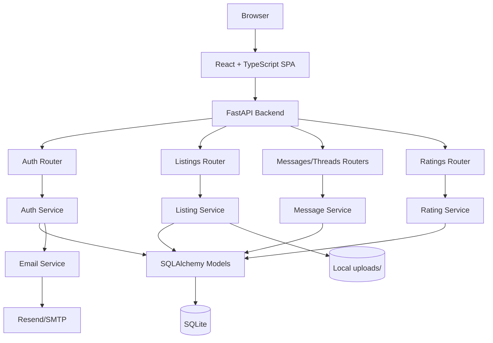
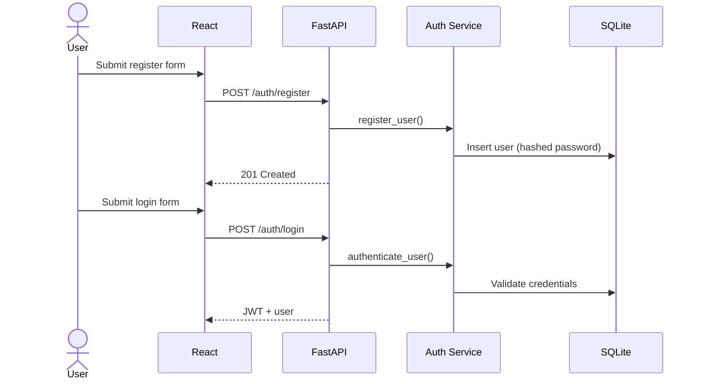
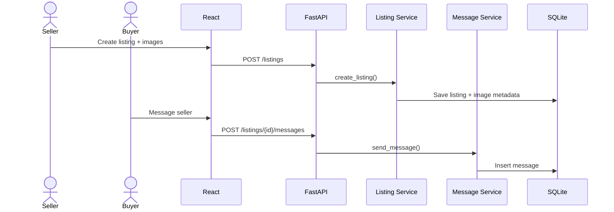
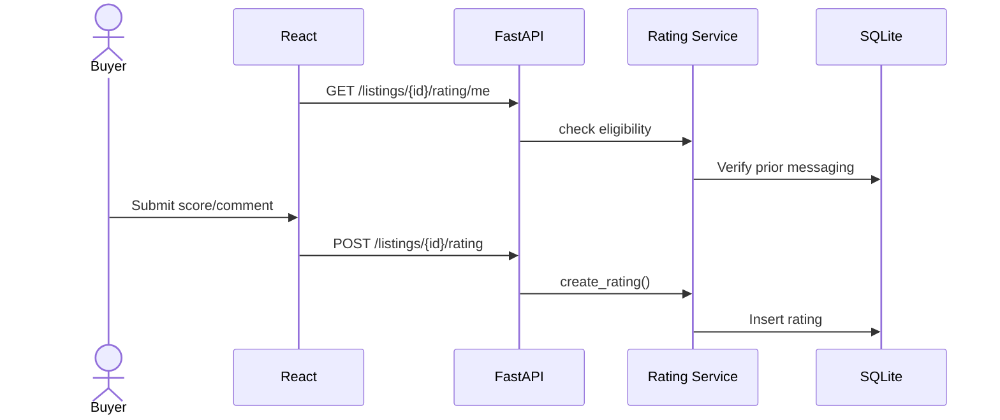
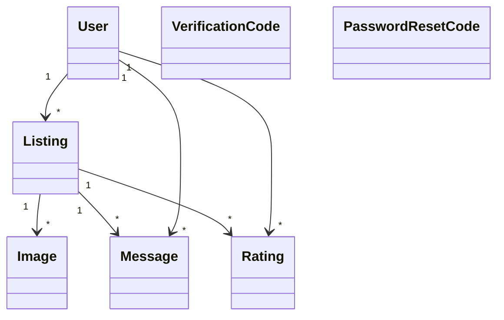

# YUTrade - Final Project Report

**Project Name:** YUTrade - York University Campus Marketplace  
**Course:** EECS 4314 - Advanced Software Engineering (Winter 2026)  
**Date:** April 5, 2026  
**Repository:** https://github.com/mai2161/YUTrade  
**Deployment:** Render (`yutrade-api`)

**Team Members**

| Name | Primary Contribution |
|---|---|
| Daniel Chahine | Authentication, JWT security, password flows |
| Michael Byalsky | Database models, ORM, fixtures |
| Lakshan Kandeepan | Listings CRUD, images, filters |
| Rajendra Brahmbhatt | Messaging, threads, CI/CD |
| Mai Komar | Frontend pages, API integration, routing |
| Harnaindeep Kaur | Frontend components, styling, auth context |

---

## 2. Requirements Traceability Matrix - Functional Requirements (/6)

All core functional requirements were implemented and validated by automated tests.

| Area | Representative Requirements | Status | Evidence |
|---|---|---|---|
| Authentication | Register/login, JWT, forgot/reset password, profile update, change password, delete account | Met | `backend/app/routers/auth.py`, `backend/app/services/auth_service.py` |
| Listings | Create/read/update/delete listings, image upload, browse/search/filter/sort/pagination | Met | `backend/app/routers/listings.py`, `backend/app/services/listing_service.py` |
| Messaging | Buyer->seller messaging, reply flow, read tracking, thread listing | Met | `backend/app/routers/messages.py`, `backend/app/services/message_service.py` |
| Ratings | Rate seller, eligibility checks, update/delete rating, seller average rating | Met | `backend/app/routers/ratings.py`, `backend/app/services/rating_service.py` |
| Frontend | Auth pages, browse/listing pages, protected routes, messaging, ratings UI | Met | `frontend/src/pages/*`, `frontend/src/components/ProtectedRoute.tsx` |

**Traceability:** Functional test cases `TC-01` to `TC-133` map requirements to implementation and outcomes.

---

## 3. Requirements Traceability Matrix - Non-Functional Requirements (/4)

| Category | Requirement | Status | Evidence |
|---|---|---|---|
| Security | JWT auth, bcrypt hashing, authorization checks, input validation | Met | `backend/app/utils/security.py`, `dependencies.py`, Pydantic schemas |
| Performance | Paginated listing API, query optimization with eager loading | Met | `routers/listings.py`, `services/listing_service.py` |
| Scalability/Maintainability | Router -> Service -> Data separation, env-based configuration | Met | `backend/app/routers`, `services`, `config.py` |
| UI Responsiveness | Responsive layout, mobile navbar/hamburger, design tokens | Met | `frontend/src/styles/global.css`, `variables.css`, `Navbar.tsx` |
| Accessibility | Focus-visible styles, semantic layout, basic ARIA labels | Partially Met | Limited ARIA usage outside core navigation |

---

## 4. Architecture Diagram (/5)

**Summary:** YUTrade uses a 3-tier architecture: React frontend, FastAPI service layer, and SQLite data layer via SQLAlchemy.

---

## 5. Sequence Diagrams (/3)

### 5.1 Registration + Login

### 5.2 Listing + Messaging

### 5.3 Rating Flow

---

## 6. Class Diagram / OOP Justification (/2)

**Justification:**
- Backend uses OOP through SQLAlchemy model classes and relationships.
- Frontend follows modern React functional composition (components + hooks + typed interfaces).

---

## 7. Design Patterns & Course Concepts (/5)

**Design patterns used:**
- Repository-style services (`services/*.py`)
- Dependency Injection (`Depends(get_db)`, `Depends(get_current_user)`)
- Middleware (CORS)
- Provider/Guard patterns in frontend (`AuthContext`, `ProtectedRoute`)
- Strategy pattern for email backends (console/Resend/SMTP)

**Course concepts demonstrated:**
- RESTful API design and status codes
- Separation of concerns (frontend modules + backend layering)
- DRY via shared helpers/fixtures
- SOLID (especially SRP and DIP)
- Validation on client + server

---

## 8. Functional Requirements Demonstration (/5)

| Requirement | Expected | Actual |
|---|---|---|
| Registration/login | Valid YorkU user gets account + JWT | Works; invalid domain/password rejected |
| Password reset | Code-based reset flow | Works with expiry + one-time use |
| Listing CRUD | Owner can create/edit/delete with images | Works; owner checks enforced |
| Browse/search/filter | Paginated searchable listings | Works with sort and price/category filters |
| Messaging | Buyer-seller communication per listing | Works with threads and read tracking |
| Ratings | Eligible buyers can rate sellers | Works; duplicate/invalid ratings blocked |

---

## 9. Usability & UI Consistency (/5)

- Shared design system in `variables.css` (colors, spacing, typography, shadows)
- Responsive layout and mobile navigation
- Consistent navigation and auth-aware route behavior
- Clear loading/error handling on major pages
- Accessibility baseline present (`:focus-visible`, semantic tags, basic ARIA)

**Known gap:** broader ARIA coverage and automated accessibility testing are still needed.

---

## 10. Source Code Repository & Good SENG Practices (/5)

- Clear repository structure (`backend`, `frontend`, `docs`, CI config)
- Environment examples (`backend/.env.example`, `frontend/.env.example`)
- `.gitignore` includes secrets, generated files, and local artifacts
- Strong team collaboration (feature branches + PR workflow)
- Deployment config present (`render.yaml`)
- Automated workflow integration in `.github/workflows`

---

## 11. Test Cases Tied to RTM (/5)

Instead of listing all 133 entries here, tests are grouped and traced as follows:

| Test Range | Focus |
|---|---|
| `TC-01` to `TC-44` | Authentication/account lifecycle |
| `TC-45` to `TC-83` | Listings + browse + image handling |
| `TC-84` to `TC-105` | Messaging + thread behavior |
| `TC-106` to `TC-130` | Ratings + eligibility + averages |
| `TC-131` to `TC-133` | End-to-end integration flows |

All groups have direct requirement links in the test suite documentation.

---

## 12. Unit Test Cases & Data (/5)

**Backend test suite:** 254 tests across 9 files

| File | Count | Scope |
|---|---:|---|
| `test_auth.py` + `test_auth_extended.py` | 74 | Auth, profile, passwords, edge cases |
| `test_listings.py` + `test_listings_extended.py` | 82 | CRUD, images, filters, pagination |
| `test_messages.py` + `test_messages_extended.py` | 38 | Messaging, threads, read state |
| `test_ratings.py` + `test_ratings_extended.py` | 53 | Rating lifecycle and constraints |
| `test_integration.py` | 7 | End-to-end user journeys |

**Infrastructure:** pytest + FastAPI TestClient + in-memory SQLite fixtures.

**Gap:** frontend automated tests are not yet implemented.

---

## 13. Test Case Outcomes (/5)

**Execution command:** `cd backend && python -m pytest tests/ --tb=short`  
**Result:** `254 passed, 0 failed`  
**Duration:** ~122 seconds

| Category | Outcome |
|---|---|
| Authentication tests | Pass |
| Listings tests | Pass |
| Messaging tests | Pass |
| Ratings tests | Pass |
| End-to-end tests | Pass |

Non-blocking deprecation warnings were observed (datetime/Pydantic/passlib), but no functional failures.

---

## 14. Summary & Self-Assessment

| Criterion | Max | Self-Score | Notes |
|---|---:|---:|---|
| Functional RTM | 6 | 5.5 | Strong traceability; frontend test IDs are less explicit |
| Non-functional RTM | 4 | 3.5 | Accessibility partly complete |
| Architecture + sequence + class diagrams | 10 | 10 | Diagrams and explanations included |
| Patterns + concepts | 5 | 5 | Clear links to implementation |
| Functional demo + usability | 10 | 8.5 | Features work; accessibility can improve |
| Repo practices | 5 | 5 | Strong collaboration + structure + deployment |
| Testing evidence + outcomes | 15 | 14 | 254/254 backend tests pass; frontend tests absent |
| **Total** | **55** | **51.5** | |

### Strengths
- Full backend feature coverage with strong automated testing
- Clean layered architecture and security controls
- Consistent UI system and responsive implementation

### Improvements
- Add frontend test coverage (components/hooks/integration)
- Improve ARIA coverage and run automated a11y checks
- Address deprecation warnings for future compatibility
